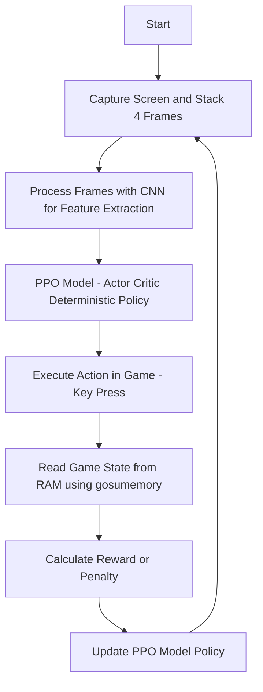
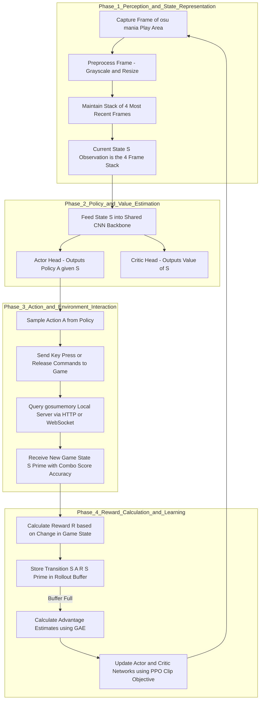

# High-Performance osu!mania PPO Agent with Direct Memory Access

This project implements an AI agent designed to master the rhythm game osu!mania. It utilizes a Proximal Policy Optimization (PPO) algorithm for learning. The key architectural feature is its high-performance data pipeline, which reads the game state (combo, score, accuracy) directly from memory using **gosumemory**. This approach bypasses the significant performance bottlenecks of traditional screen-scraping or OCR techniques, enabling highly efficient, high-framerate training.

## 🌟 Key Features

-   **Advanced PPO Agent**: Leverages the robust Proximal Policy Optimization (PPO) algorithm from `stable-baselines3`, known for its sample efficiency and stability in complex control tasks. This ensures steady, incremental learning without catastrophic forgetting.

-   **High-Speed Memory Reading**: Integrates with gosumemory to achieve near-instantaneous (<1ms) updates on the game state. This low-latency feedback is critical for accurate reward calculation and allows the agent to develop precise timing.

-   **Optimized Training Pipeline**: The entire environment and data processing pipeline are engineered for high throughput. This allows for high FPS training sessions, which accelerates the learning process and improves the agent's rhythmic accuracy.

-   **Live Gameplay Visualization**: A real-time window displays the agent's visual input, its currently selected actions, and key game metrics. This provides valuable insight into the agent's decision-making process as it learns.

-   **GPU Acceleration**: Utilizes PyTorch and a CUDA-enabled GPU for all neural network computations, significantly speeding up model inference and training steps.

-   **Robust Training Framework**: Features automatic model checkpointing to safeguard training progress and full TensorBoard integration for comprehensive monitoring of rewards, loss, and other learning metrics.

## 💥 Performance Analysis: The Advantage of Memory Reading over OCR

The performance of a reinforcement learning agent is directly tied to the speed and quality of its feedback loop.

### The Inefficiency of OCR
Initial prototypes for this project relied on Optical Character Recognition (OCR) to parse game state from the screen. This approach introduced a severe performance bottleneck. The OCR process competed with the agent's neural network for GPU resources, and the inherent latency of screen capture combined with text recognition (~300ms) resulted in an unacceptably low training rate of approximately 3 FPS. At this speed, the agent receives delayed and disjointed feedback, making it impossible to learn the precise timing required for a rhythm game.

### The Solution: Direct Memory Access
To resolve this critical issue, the architecture was redesigned to read game state directly from the application's memory via gosumemory. This change completely eliminated the OCR bottleneck. The program's speed is now primarily limited by the highly optimized screen capture and model inference times. The result is a smooth, efficient, and high-FPS training loop that provides the agent with the immediate feedback necessary for effective learning.

## 🔧 How It Works: The Reinforcement Learning Loop

The agent operates on a continuous perception-action-reward cycle. Each step in this loop is designed for maximum efficiency to facilitate rapid learning.

1.  **Visual Perception (Seeing the Game)**: The agent's process begins by capturing the visual state of the note highway. To perceive motion and velocity, it stacks the four most recent frames into a single tensor. This stack is fed into a Convolutional Neural Network (CNN), which acts as a powerful feature extractor, learning to identify notes, their positions, and their patterns of descent.

2.  **Decision Making (Action Selection)**: The features extracted by the CNN are passed to the PPO model, which consists of two sub-networks: an Actor and a Critic.
    -   The **Actor** network is responsible for policy-making. It outputs a probability distribution over all possible actions (i.e., every combination of key presses).
    -   The **Critic** network evaluates the current state, predicting the expected future reward from that state. This evaluation helps guide the Actor's learning process.
    The agent then samples an action from the Actor's probability distribution to execute in the game.

3.  **State Feedback (The Secret Sauce)**: Immediately after the action is executed, the agent queries gosumemory's local server. In under a millisecond, it retrieves the precise, up-to-date game state (combo, score, accuracy). This immediate, low-latency feedback is the core advantage of the memory-reading approach.

4.  **Learning and Policy Update (Reward/Punishment)**: The agent calculates a reward or penalty based on the change in the game state resulting from its action.
    -   A combo increase yields a strong positive reward.
    -   A combo break results in a significant penalty.
    -   Minor rewards/penalties are given for score changes, key spamming, or inaction.
    This reward signal is used to update the PPO model. The algorithm compares the actual reward received to the Critic's prediction. If the outcome was better than predicted, the policy is adjusted to make that action more likely in similar future states. If it was worse, the policy is adjusted to avoid it. This rapid, iterative loop allows the agent to efficiently learn and refine its gameplay strategy.<!-- filepath: c:\Users\quang\Downloads\Project\rl\OsuMania-PPO-EasyOCR\PPOsu\README.md -->
# High-Performance osu!mania PPO Agent with Direct Memory Access

This project implements an AI agent designed to master the rhythm game osu!mania. It utilizes a Proximal Policy Optimization (PPO) algorithm for learning. The key architectural feature is its high-performance data pipeline, which reads the game state (combo, score, accuracy) directly from memory using **gosumemory**. This approach bypasses the significant performance bottlenecks of traditional screen-scraping or OCR techniques, enabling highly efficient, high-framerate training.

## 🌟 Key Features

-   **Advanced PPO Agent**: Leverages the robust Proximal Policy Optimization (PPO) algorithm from `stable-baselines3`, known for its sample efficiency and stability in complex control tasks. This ensures steady, incremental learning without catastrophic forgetting.

-   **High-Speed Memory Reading**: Integrates with gosumemory to achieve near-instantaneous (<1ms) updates on the game state. This low-latency feedback is critical for accurate reward calculation and allows the agent to develop precise timing.

-   **Optimized Training Pipeline**: The entire environment and data processing pipeline are engineered for high throughput. This allows for high FPS training sessions, which accelerates the learning process and improves the agent's rhythmic accuracy.

-   **Live Gameplay Visualization**: A real-time window displays the agent's visual input, its currently selected actions, and key game metrics. This provides valuable insight into the agent's decision-making process as it learns.

-   **GPU Acceleration**: Utilizes PyTorch and a CUDA-enabled GPU for all neural network computations, significantly speeding up model inference and training steps.

-   **Robust Training Framework**: Features automatic model checkpointing to safeguard training progress and full TensorBoard integration for comprehensive monitoring of rewards, loss, and other learning metrics.

## 💥 Performance Analysis: The Advantage of Memory Reading over OCR

The performance of a reinforcement learning agent is directly tied to the speed and quality of its feedback loop.

### The Inefficiency of OCR
Initial prototypes for this project relied on Optical Character Recognition (OCR) to parse game state from the screen. This approach introduced a severe performance bottleneck. The OCR process competed with the agent's neural network for GPU resources, and the inherent latency of screen capture combined with text recognition (~300ms) resulted in an unacceptably low training rate of approximately 3 FPS. At this speed, the agent receives delayed and disjointed feedback, making it impossible to learn the precise timing required for a rhythm game.

### The Solution: Direct Memory Access
To resolve this critical issue, the architecture was redesigned to read game state directly from the application's memory via gosumemory. This change completely eliminated the OCR bottleneck. The program's speed is now primarily limited by the highly optimized screen capture and model inference times. The result is a smooth, efficient, and high-FPS training loop that provides the agent with the immediate feedback necessary for effective learning.

## 🔧 How It Works: The Reinforcement Learning Loop

The agent operates on a continuous perception-action-reward cycle. Each step in this loop is designed for maximum efficiency to facilitate rapid learning.

1.  **Visual Perception (Seeing the Game)**: The agent's process begins by capturing the visual state of the note highway. To perceive motion and velocity, it stacks the four most recent frames into a single tensor. This stack is fed into a Convolutional Neural Network (CNN), which acts as a powerful feature extractor, learning to identify notes, their positions, and their patterns of descent.

2.  **Decision Making (Action Selection)**: The features extracted by the CNN are passed to the PPO model, which consists of two sub-networks: an Actor and a Critic.
    -   The **Actor** network is responsible for policy-making. It outputs a probability distribution over all possible actions (i.e., every combination of key presses).
    -   The **Critic** network evaluates the current state, predicting the expected future reward from that state. This evaluation helps guide the Actor's learning process.
    The agent then samples an action from the Actor's probability distribution to execute in the game.

3.  **State Feedback (The Secret Sauce)**: Immediately after the action is executed, the agent queries gosumemory's local server. In under a millisecond, it retrieves the precise, up-to-date game state (combo, score, accuracy). This immediate, low-latency feedback is the core advantage of the memory-reading approach.

4.  **Learning and Policy Update (Reward/Punishment)**: The agent calculates a reward or penalty based on the change in the game state resulting from its action.
    -   A combo increase yields a strong positive reward.
    -   A combo break results in a significant penalty.
    -   Minor rewards/penalties are given for score changes, key spamming, or inaction.
    This reward signal is used to update the PPO model. The algorithm compares the actual reward received to the Critic's prediction. If the outcome was better than predicted, the policy is adjusted to make that action more likely in similar future states. If it was worse, the policy is adjusted to avoid it. This rapid, iterative loop allows the agent to efficiently learn and refine its gameplay strategy.